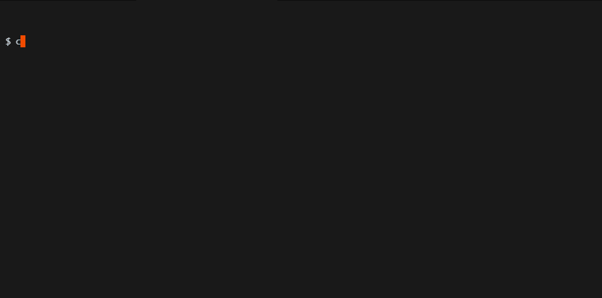

# Template for Python Projects

Opinionated cookiecutter template for Python projects which uses `uv` to manage
packages and Python installations. You can use the template to quickly get up
and running for:

- Python packaging
- Machine Learning projects
- Data analysis
- Docker deployments
- API development
- Automation scripts
- ...

---

<div align="center">
    
</div>

## Comes with...

- `uv` to manage packages and Python installations
- `pytest` for unit-testing
- `pre-commit`:
    - `ruff` hook to format and lint code
    - `uv` hook to keep `uv.lock` up-to date
    - `gitleaks` hook to prevent you from committing secrets (API keys, etc.)
- GitHub action to execute tests.
- [Optional] Docker template (with Python and `uv`)

> [!NOTE]
> The cookiecutter template let's YOU set the Python version! A Python installation is *not* required. `uv` will install the appropriate Python version, if necessary.

## 1️⃣ Prerequisites

As a prerequisite, you need to have [`uv`](https://docs.astral.sh/uv/)
installed. Visit the installation [guide](https://docs.astral.sh/uv/getting-started/installation/)
(it's really simple to set-up).

With `uv`, install `pre-commit` and `cookiecutter` as tools.

```bash
uv tool install pre-commit cookiecutter
```

That's it!

## 2️⃣ Usage

To use the cookiecutter template:

```bash
cookiecutter https://github.com/JakobKlotz/python-template.git
```

... which walks you through the set-up of your project. After the project 
structure creation, the virtual environment and `pre-commit` hooks are 
automatically installed. 🚀

## Contributions

Any contributions are welcome! 👋🏽 
Check out [CONTRIBUTING.md](CONTRIBUTING.md)
